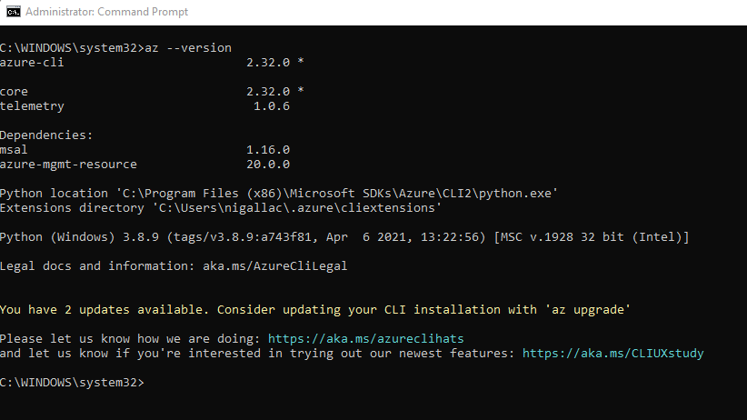
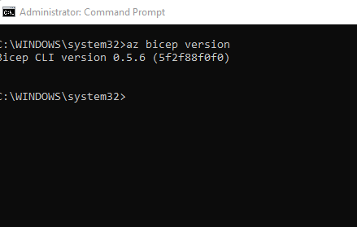

# Challenge 0: Pre-requisites - Ready, Set, GO! 

## Introduction

**NOTE:** The update / installation of Azure CLI can take approx. 30mins
## Description
In this challenge we'll be setting up all the tools we will need to complete our challenges.

- Ensure you have:
  - A sandbox [Azure Subscription](https://azure.microsoft.com/en-us/free/) for this workshop, where attendees have the rights to create various resources.
    - If using cloud shell, ensure you have a storage account created for cloud shell to connect to
   - A sandbox Azure DevOps organisation for this workshop, where attendees have the rights to create new Azure DevOps Project within the organisation.
  
  
- Install the recommended toolset:
  - [Azure CLI](https://docs.microsoft.com/en-us/cli/azure/install-azure-cli)
    - Must be at least version 2.20.x
  - [Visual Studio Code](https://code.visualstudio.com/)
  - Bicep plugins for VS Code
    - [Bicep VS Code Extension](https://marketplace.visualstudio.com/items?itemName=ms-azuretools.vscode-bicep)
   - [Bicep CLI](https://docs.microsoft.com/en-us/azure/azure-resource-manager/bicep/install) - AzureCLI version 2.20 & higher should include the Bicep CLI tools.  If you are using PowerShell, you must follow the instructions at this link to install the Bicep CLI.
   - OPTIONAL [PowerShell Cmdlets for Azure](https://docs.microsoft.com/en-us/powershell/azure/install-az-ps?view=azps-6.4.0)

## Success Criteria

1. You have Azure Cloud Shell or VSCode
2. Running `az --version` shows the version of your Azure CLI, at least version 2.20.x

3. Bicep tools installed  

5. Visual Studio Code and Bicep tools are installed.

## Resources

  -	Quickstart ARM Templates: https://azure.microsoft.com/en-us/resources/templates/
  -	Bicep Playground: https://bicepdemo.z22.web.core.windows.net/ 
